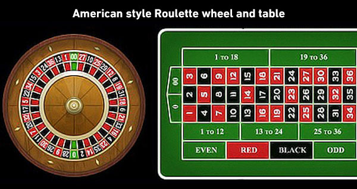
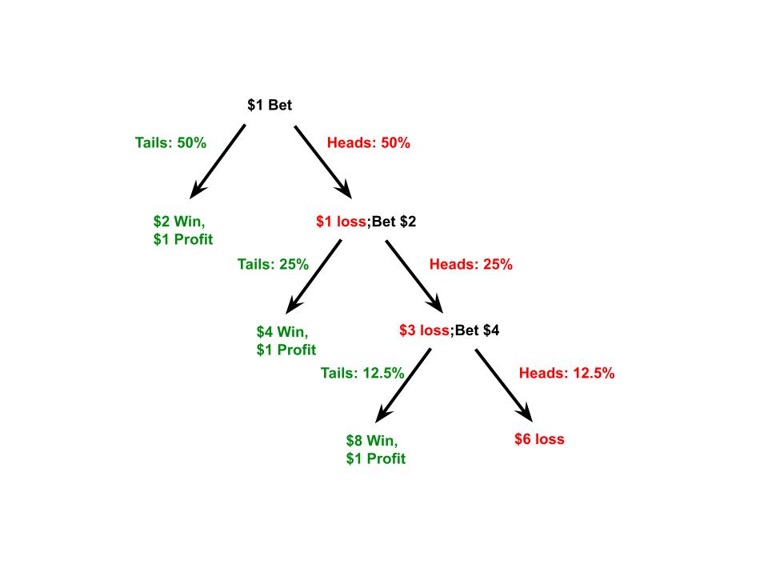

# Roullete
Python script to aid in the explanation of the Martingale System for roulette by simulating the method of betting.

The martingale method is a strategy of betting developed for situations where the odds of winning or losing are 50/50. When a person's odds of winning or losing are the same, the expected value is 0. This means that if a person were to bet $1 per coin flip on the outcome, they may be correct some of the time and win money, but they can expect to guess incorrectly the same amount of times, losing the same amount of money they won and returning back to $0.

The Martingale Method takes advantage of the sureness that whether they choose heads or tails, they will eventually get it correct. If a person decided to bet tails every time, they can opt to double their bet every time the coin lands on heads. This allows for the time it does land on tails, no matter how many times it has landed heads before, the amount won is equal to that of all the previous losses plus 1... thus a $1 profit no matter how many times the coin landed on head prior. 

This scenario can be visualized below:

| Losses in a row (Times Doubles) | Amount Bet | Chances of losing next flip | Total Wagered | Amount Won | Net Profit |
|---------------------------------|------------|-----------------------------|---------------|------------|------------|
| 0                               | $1         | 50%                         | $1            | $2         | $1         |
| 1                               | $2         | 25%                         | 3             | $4         | $1         |
| 2                               | $4         | 12.5%                       | 7             | $8         | $1         |
| 3                               | $8         | 6.25%                       | 15            | $16        | $1         |
| 4                               | $16        | 3.125%                      | $31           | $32        | $1         |
| 5                               | $32        | 1.5625%                     | $63           | $64        | $1         |
| 6                               | $64        | 0.78125%                    | $127          | $128       | $1         |
